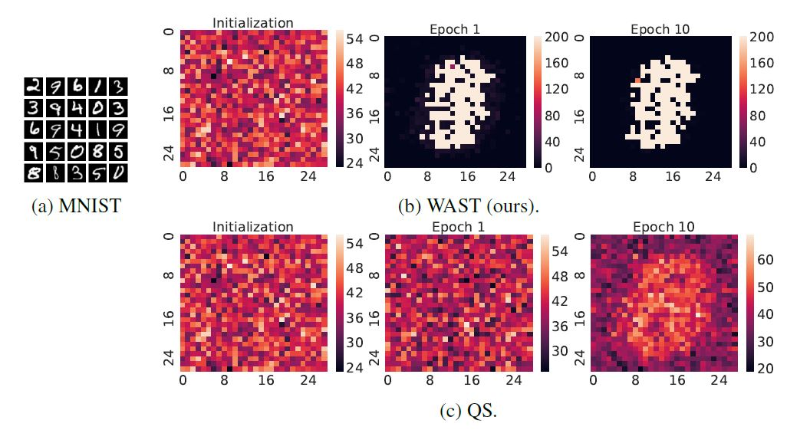

# Where to Pay Attention in Sparse Training for Feature Selection?

[NeurIPS2022] Where to Pay Attention in Sparse Training for Feature Selection? by Ghada Sokar, Zahra Atashgahi, Mykola Pechenizkiy, and Decebal Constantin Mocanu.

# Abstract

WAST is a new dynamic sparse method based on autoencoder that quickly detect the informative input features using a few training iterations.

# Usage
You can use main.py to run, which has the following main arguments:

--data (string): the name of the dataset. Options: madelon, USPS, coil, mnist, FashionMnist, HAR, Isolet, PCMAC, SMK, GLA 

--K (int): number of target selected features

--density (float): the density level of the network (1-sparsity level). Default 0.2

--lamda (float): the coeff in neuron importance criteria. Default for Image datasets 0.4, SMK 0.01, GLA 0.001, and all other types 0.9

--strength (str): The criteria to choose the final target features. 
                  Options: "IMP" (based on the calculated neuron importance during training), "weight" (based on the magititue of its connected weights).
		  Default "IMP" for WAST and "weight" for QS.

--rmv_strategy (str): The criteria used for estimating the impotance of a connection for connection drop. 
                      Options: "rmv_IMP" (based on its matgnitue and connected weight), "magnitute" (based on its magnitute). 
                      Default "rmv_IMP" for WAST and "magnitute" for QS

--add_strategy (str): The criteria used for estimating the impotance of a neuron for connection regrowth
                      Options: "add_IMP" (based on neuron importance), "random". 
                      Default "add_IMP" for WAST and "random" for QS

--alpha (float): fraction of dropped and regrwon connections in topological update. Default 0.3

--update_batch (bool): the schedule for topology update. 
                       Options: True (udate after each weight update), False (update after each training epoch). 
                       Default: True for WAST and False for QS  

--epochs (int): number of epochs to train the model. Default: 10

# Results

